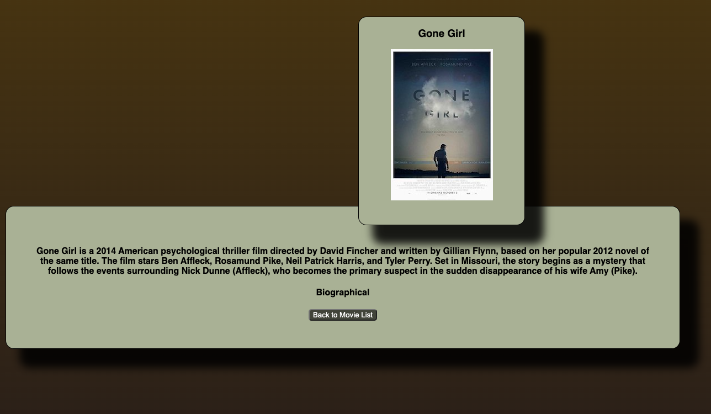

# Project Name
Weekend Movie Sagas

## Description

For this project we practiced using React-Redux, Redux-Sagas, and SQL. 

One of the more difficult things on this project for me was getting the SQL query text to join tables so that I could include the cooresponding genres for each movie. I used postico to test my querys with dummy data before implementing it in the genre.router. The other part that I spent a considerable amount of time with was simply using css. I decided to go with a grid on the list page which made it easier to sort everything out. The details page proved to more difficult to make visually interesting since there simply isn't a lot of data to display. I experimented with making the entire backround of the details page be the poster of the movie that was selected, unfortunatly when the imaged is enlarged it looks terrible, so I decided to keep it small. 

## Acknowledgements 

I would like to thank Benjamin Pedrick for helping me sort the query text, and Josh K for giving me a crash course in grid work earlier in the week. 

